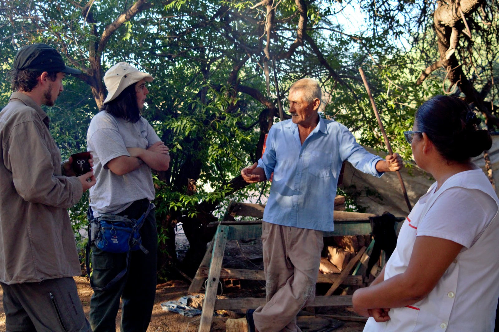

                                                        👋 Hi! I'm Victoria Marquez

🌱 Ecologist interested in how environmental changes affect interactions between plants and pollinators.

📚 I love statistics and data analysis, with experience in mixed models, machine learning, and multivariate analysis.

💻 Proficient in R and Python.

👩‍🏫 I enjoy teaching and scientific outreach.

📄 My doctoral thesis focused on the impacts of land use changes on ecological systems, adding valuable insights to my research.

🥋 Passionate about martial arts, I find balance and inspiration in the discipline and philosophy of the practice

🔗 Connect with me on LinkedIn [here](https://www.linkedin.com/in/vicmarquez/)

🔬 You can explore my research work and publications [here](https://www.researchgate.net/profile/Victoria-Marquez?ev=hdr_xprf)

